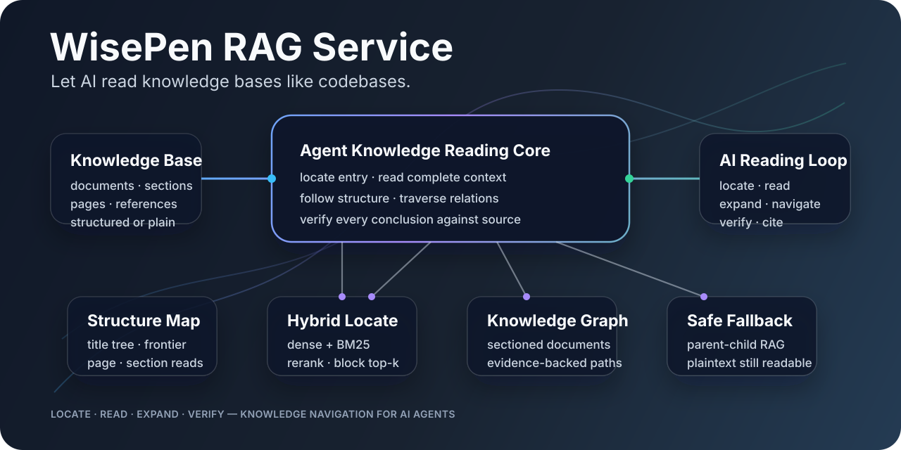

# 🧠 WisePen RAG Service

> 让 AI 像阅读代码一样阅读知识库。




Codex 这类 Agent 能高效阅读代码库，不只是因为代码可以搜索，更因为代码天然拥有一套可阅读的骨架：目录、文件、符号、引用、调用链和依赖关系。Agent 可以先定位入口，再打开完整上下文，沿结构与关系逐步展开，并随时回到源码验证结论。

知识库也应该这样被阅读。

WisePen RAG Service 的核心目标不是“召回更多 chunk”，而是把文档投影成一套适合 Agent 探索的知识阅读系统：**混合检索负责定位，Section 树负责阅读，知识图谱负责跳转，SourceRef 负责验证。** AI 不必一次吞下整份资料，也不必根据零散片段猜测上下文，而是像读代码一样持续执行：

```text
LOCATE  ->  READ  ->  EXPAND  ->  VERIFY
找到入口    阅读上下文    沿结构和关系探索    回到原文证据
```

## 💡 从“检索片段”到“阅读知识库”

传统 RAG 往往在返回 top-k chunk 时结束工作。WisePen 把检索视为阅读的开始。

| 阅读代码库 | 阅读知识库 | WisePen 能力 |
| ---------- | ---------- | ------------ |
| 搜索符号和引用 | 从问题找到相关内容 | dense + BM25 + rerank 的 `locate` |
| 打开完整函数或文件 | 阅读命中位置的完整上下文 | `ReadingBlock` 与 `SectionView` |
| 浏览目录和相邻符号 | 沿章节层级继续阅读 | parent / previous / next / children frontier |
| 追踪调用链和依赖 | 跨文档追踪实体与关系 | evidence-backed knowledge graph |
| 按路径打开源码 | 按文档结构确定性读取 | document structure / page / section content |
| 回到源码核验结论 | 回到权威正文核验证据 | `SourceRef` 原文坐标 |

这套阅读模型让 Agent 能处理比“一问一答”更复杂的任务：理解一份长报告、比较多个制度版本、追踪概念来源、解释跨文档依赖，或围绕一个主题持续调查。

## 🔁 Agent 知识阅读循环

### 1. Locate：找到值得阅读的入口

`locate(query)` 使用 dense 与原生 BM25 召回候选，经过融合和 rerank 后选择最相关的 **ReadingBlock 窗口**，而不是直接把检索子块当成最终上下文。

```text
query
  -> dense + BM25 candidates
  -> ranking / rerank RetrievalChunks
  -> dedup by (resource_id, reading_block_id)
  -> top-k ReadingBlocks
  -> authoritative source materialization
```

`RetrievalChunk` 是评分单位，`ReadingBlock` 是阅读单位。同一个父块内的多个相邻 child 不会重复占用 top-k；同一长 Section 中多个真正相关的 ReadingBlock 则可以同时返回。

### 2. Read：恢复完整、连续的上下文

命中的 RetrievalChunk 会提升到父级 ReadingBlock，并组织为 `SectionView`。Agent 获得的不只是相似文本，还包括：

- 可直接阅读的父级正文窗口；
- 当前 Section 的标题路径和结构位置；
- 精确 evidence 与 page / anchor labels；
- parent、previous、next、children 的轻量 frontier。

检索粒度保持精细，模型读取的上下文保持完整。两者不再被迫使用同一种切块尺寸。

### 3. Expand：沿结构和关系继续探索

Agent 可以从两种互补路径扩展阅读范围：

```text
Structural navigation
  sections(state_id, section_ids)
  -> 读取完整 Section
  -> 展开 parent / siblings / children

Relational navigation
  cypher(state_id, node_ids)
  -> 追踪实体、依赖、引用和来源关系
  -> 回到新的 evidence Section
```

标题树回答“这份文档接下来应该读哪里”，知识图谱回答“这条知识关系还能通向哪里”。图谱用于发现路径，不替代正文，也不承担首轮全文检索。

### 4. Verify：所有结论都能回到原文

向量、rerank 分数、contextual text 和图谱关系都是派生信号，不是事实源。每个 RetrievalChunk、ReadingBlock、mention 和 relation 最终都通过 `SourceRef` 映射回原始 Markdown 的 Python 字符半开区间。

因此 Agent 可以从“可能相关”走到“原文确实这样写”，而不是把向量库或 LLM 抽取结果当作不可核验的事实。

## 🗺️ 两套互补的阅读入口

### 探索式阅读

当 Agent 只有一个问题，还不知道答案在哪时：

```text
locate -> sections -> cypher -> sections -> ...
```

导航状态保存已发现的 Section 和图节点，让后续探索受控、渐进，并避免一次性加载无关正文。

### 确定性阅读

当任务已经给出“见第三页”“查看部署章节”或某个明确文档时，Agent 不需要绕一圈语义检索：

| MCP tool | 作用 |
| -------- | ---- |
| `rag_get_document_structure` | 获取 `structure_mode`、page labels 和 Section tree |
| `rag_get_page_content` | 按 page label 读取权威正文 |
| `rag_get_section_content` | 按 section id 读取权威正文 |

这相当于代码 Agent 的“列目录”和“打开文件”：低成本、可预测，也是单靠知识图谱无法稳定覆盖的能力。

## 🧬 结构化文档：把 Markdown 变成知识骨架

规范 Markdown 不只是更容易切块，它会解锁完整的结构增强能力。

### 标题树

Heading 被投影为稳定的 Section 树，保留 `section_path`、父子关系、正文范围、subtree 范围、page labels，以及 table / figure / formula anchors。长 Section 可以拥有多个有序 ReadingBlock，结构与阅读窗口不再一一绑定。

### Contextual Index

每个 RetrievalChunk 可以结合 Section 路径、Section preview 和父级 ReadingBlock 生成 indexing context。context 只增强 embedding 输入，不覆盖原文，也不改变 evidence offset。

### Evidence-grounded Knowledge Graph

实体和关系从 ReadingBlock 级证据窗口抽取，以保留跨句指代和局部语境。图中的 mention 与 relation 必须绑定原文证据，`cypher` 发现的新路径最终仍回到 Section 继续阅读。

## 🛡️ 安全降级：坏结构不能破坏阅读能力

“像读代码一样阅读”依赖结构，但真实上游并不总能提供结构。解析结果可能完全没有标题，甚至把数万字符正文输出成一个巨大 paragraph。WisePen 不会把所有内容塞进一个 root Section，也不会为不可靠结构浪费图谱 LLM。

系统在昂贵派生流程之前明确判定三种 `structure_mode`：

| 模式 | 输入 | 阅读能力 |
| ---- | ---- | -------- |
| `sectioned` | 存在真实 Markdown Heading | 标题树、Contextual Index、知识图谱和全部阅读入口 |
| `flat_text` | 无 Heading，但存在有效正文 | 父子分块、混合检索、合成 Section 和确定性直读 |
| `empty` | 无有效正文 | 发布空投影并清理旧索引与旧图谱 |

### Plaintext-like Markdown 的能力下限

`flat_text` 使用现有 `PlainTextChunker` 构造传统父子 RAG：

```text
plaintext-like Markdown
  -> 6000 chars, overlap 0
     -> synthetic Section: 全文片段 N
     -> ReadingBlock: model-readable parent
        -> 800 chars, overlap 100
           -> RetrievalChunk: dense + BM25 child
```

即使一份文档没有任何标题，系统仍然保证：

- dense + BM25 混合检索和 rerank 正常工作；
- 细粒度 child 负责召回，命中后提升到 6000 字符 parent；
- 多个命中父窗口可同时进入 ReadingBlock top-k；
- 合成 Section 支持 document structure 和 section content 直读；
- page marker 不进入索引正文，但 page label 与原文 offset 仍被保留；
- contextual indexing 与 graph extraction 被明确跳过。

合成标题只承担导航职责，不进入 embedding 文本。若资源从 `sectioned` 变为 `flat_text`，系统会清理旧 relations、mentions 和孤立节点，再以幂等状态记录当前 revision 已跳过图谱，避免陈旧知识关系继续参与导航。

安全降级不是系统主旨，但它守住了主旨：**即使知识库暂时失去结构，AI 仍然能够定位、阅读和验证，只是不能使用没有可靠依据的结构增强与图谱跳转。**

## 🧱 阅读数据模型

| 对象 | 面向谁 | 职责 |
| ---- | ------ | ---- |
| `Section` | 导航 | 表达标题树、阅读顺序和结构边界 |
| `ReadingBlock` | Agent | 提供连续、可理解的父级正文窗口 |
| `RetrievalChunk` | 检索器 | 承担 embedding、BM25 和 rerank |
| `SourceRef` | 证据系统 | 将派生结果映射回权威原文 span |
| Graph node / relation | 探索器 | 暴露跨文档知识路径及其 evidence |

这个分层是系统的关键：**搜索对象、阅读对象、导航对象和证据对象各自拥有清晰职责。**

## 🧩 核心组件

| 组件 | 在阅读系统中的职责 |
| ---- | ------------------ |
| Markdown parser | 识别 headings、pages、anchors 和原文范围 |
| `MarkdownChunker` | 从结构化文档构建 Section、ReadingBlock 和 RetrievalChunk |
| `PlainTextChunker` | 为无标题正文建立可用的父子阅读层级 |
| Qdrant | dense + sparse BM25 首轮定位 |
| Ranking pipeline | 融合、rerank 和 ReadingBlock 级结果选择 |
| Section navigator | 组织 SectionView 与结构 frontier |
| Neo4j | 保存有原文证据的跨文档知识路径 |
| Evidence materializer | 通过 SourceRef 回读权威正文 |

Mongo、Qdrant、Neo4j 和 Redis 是语义模型的持久化实现，而不是系统设计的出发点。

## ✅ 核心不变量

- 检索只负责发现入口，最终正文必须回源。
- `RetrievalChunk` 是评分单位，`ReadingBlock` 是 top-k 阅读单位。
- 同一 ReadingBlock 只保留最高排名 child，同一 Section 的不同 ReadingBlock 均可保留。
- 图谱用于扩展阅读路径，不替代混合检索与原文证据。
- document structure 不返回正文，page / section content 承担确定性读取。
- `SourceRef` 始终使用原始 Markdown 的 Python 字符半开区间。
- `flat_text` 与 `empty` 不调用 contextual indexing 或 graph extractor。
- 输入结构变差时只降低增强能力，不降低基础混合检索与父子阅读能力。

## 🏭 生产保证

服务使用 applied revision 避免读取半成品投影，读取链路执行 ACL 校验，资源更新与删除会同步清理向量、图谱和导航派生状态。这些机制服务于同一个目标：Agent 看到的结构、正文和证据必须属于同一份有效内容。

## 🛠️ 接口

知识导航：

```text
POST /internal/rag/knowledge-navigation/locate
POST /internal/rag/knowledge-navigation/sections
POST /internal/rag/knowledge-navigation/cypher
```

资源直读：

```text
POST /internal/rag/resources/document-structure
POST /internal/rag/resources/page-content
POST /internal/rag/resources/section-content
```

## ⚡ 本地启动

从 `services/wisepen-rag-service/src` 启动：

```bash
uv run python -m rag.main
```

```text
GET /health
GET /docs
```

## 📖 延伸文档

- [系统设计理念](docs/design.md)
- [核心功能](docs/core_capabilities.md)
- [暴露接口](docs/interfaces.md)
